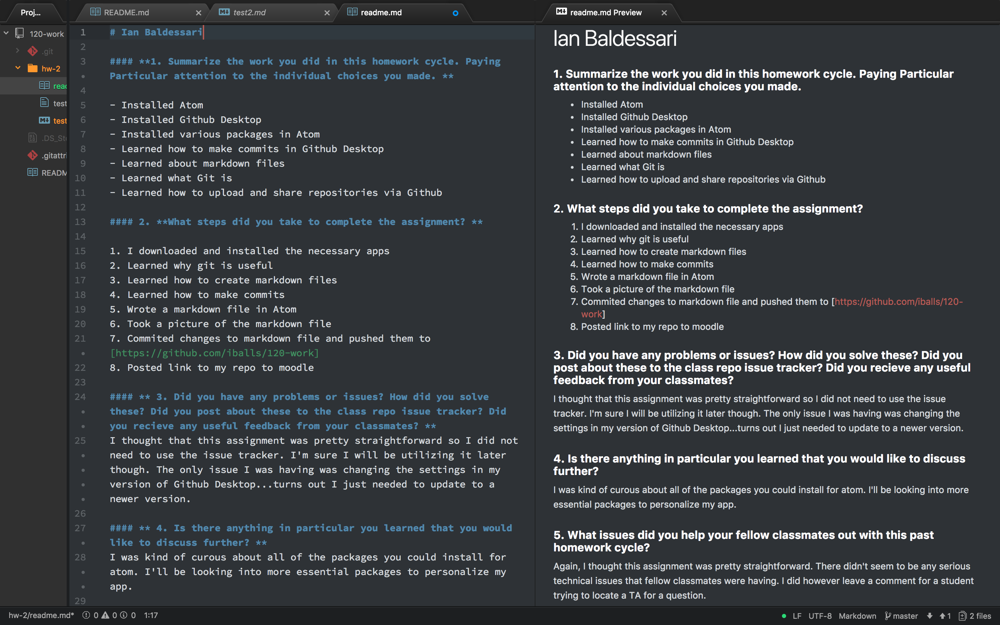

# Ian Baldessari

#### **1. Summarize the work you did in this homework cycle. Paying Particular attention to the individual choices you made. **

- Installed Atom
- Installed Github Desktop
- Installed various packages in Atom
- Learned how to make commits in Github Desktop
- Learned about markdown files
- Learned what Git is
- Learned how to upload and share repositories via Github

#### 2. **What steps did you take to complete the assignment? **

1. I downloaded and installed the necessary apps
2. Learned why git is useful
3. Learned how to create markdown files
4. Learned how to make commits

  `git commits`
5. Wrote a markdown file in Atom
6. Took a picture of the markdown file
7. Commited changes to markdown file and pushed them to [https://github.com/iballs/120-work]
8. Posted link to my repo to moodle

#### ** 3. Did you have any problems or issues? How did you solve these? Did you post about these to the class repo issue tracker? Did you recieve any useful feedback from your classmates? **
I thought that this assignment was pretty straightforward so I did not need to use the issue tracker. I'm sure I will be utilizing it later though. The only issue I was having was changing the settings in my version of Github Desktop...turns out I just needed to update to a newer version.

#### ** 4. Is there anything in particular you learned that you would like to discuss further? **
I was kind of curous about all of the packages you could install for atom. I'll be looking into more essential packages to personalize my app.

#### ** 5. What issues did you help your fellow classmates out with this past homework cycle? **
Again, I thought this assignment was pretty straightforward. There didn't seem to be any serious technical issues that fellow classmates were having. I did however leave a comment for a student trying to locate a TA for a question.

