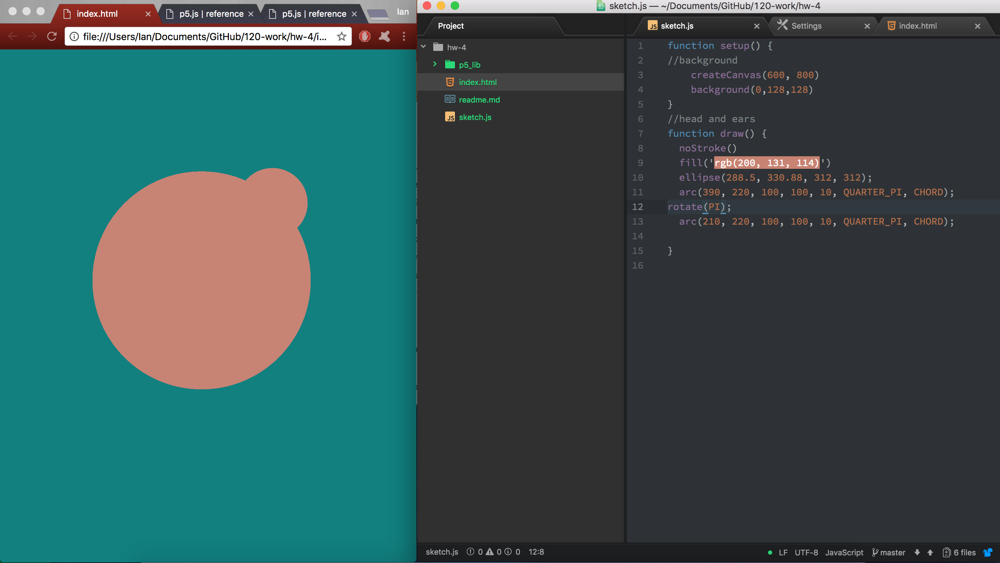

### Ian Baldessari // MART 120, Sec 50

[It's a Bear!](https://iballs.github.io/120-work/hw-4/)

## HW-4 Reflection

Oh boy did it take me a long time to figure out how to make this bear. I think I understand the order of operations and placing shapes fairly well, but I struggled with moving objects around the canvas. The commands that gave me the most trouble were:

- arc
- translate
- rotate

After reading through the p5 reference I gathered that my main issue with arc was not understanding where the shape was beginning and where it was ending. It seemed to me that the two points would change depending where on the canvas they were placed.

Rotate and translate when used in conjunction still confuse the hell out of me. Whenever I had an item such as an eyebrow that I needed reflected I would copy the code and attempt to rotate the item 180 degrees and translate it so it would reflect the other side. Every time though the shape would go flying off of the canvas. I asked my friend for help and he suggested trying PI or -PI to reflect and item, but that did not work for me:

Another issue I ran into, which really was just an annoying bug was that my index.html would not open in chrome. It worked the first time I sat down to work on this assignment, but not the second or the third time. I had to fallback and use safari. Any idea as to why this happens? Everytime I told my index.html to open in chrome it would just open a new browser window.

I enjoyed this weeks assignment and it got me thinking about how to place objects on a canvas. Before starting on my assignment I actually made my creature in Illustrator to get a grasp on where things would be placed in reference to the pixels on the canvas. This actually helped my design quite a bit when I realized everything in Illustrator is basically just a GUI interface for p5 shapes.
